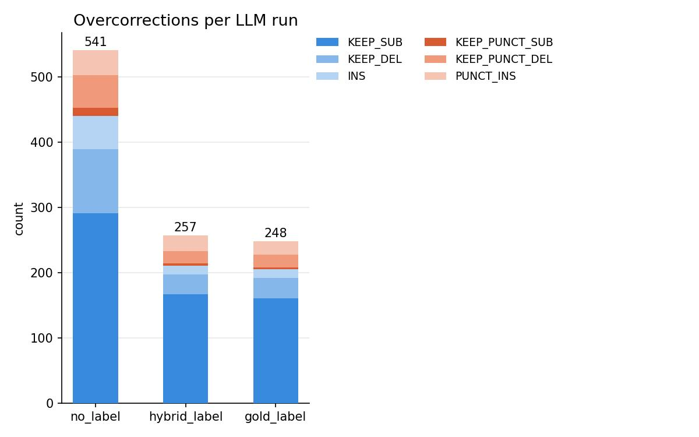

# IdeeFix-DE

IdeeFix-DE is a German grammatical error correction (GEC) pipeline that combines 
an encoder-based error detection model with a large language model (LLM) corrector. 
Instead of letting the LLM correct everything freely we first detect which tokens are actually 
erroneous using a fine-tuned encoder, and pass the labeled sentence along with the erroneous sentence to the LLM 
for correction. This keeps recall stable while significantly improving precision.

## Motivation

LLMs are strong at grammatical correction but tend to over-edit: they change things 
that don't need changing, alter style, or introduce new errors. In ASR pipelines this 
is especially problematic when users expect a WYSIWYG (what you say is what you get) 
experience. We want control over what gets corrected, not a rewrite. By constraining 
the LLM to encoder-detected error regions, we reduce these overcorrections without 
sacrificing correction quality on true errors.

## Overcorrection Reduction

The plot below shows the reduction in overcorrection labels across three pipeline 
configurations: no labeling (LLM only), hybrid labeling (encoder-detected), and gold 
labeling (oracle).

## Credits and Acknowledgements

### GECToR Implementation
This project uses an adapted version of the 
[GECToR implementation](https://github.com/gotutiyan/gector). The original architecture is described in:
> Omelianchuk et al. (2020). GECToR – Grammatical Error Correction: 
> Tag, Not Rewrite. ACL 2020.

### Base Model
- [deepset/gbert-large](https://huggingface.co/deepset/gbert-large) 
  by deepset, licensed under MIT

### Data Sources
- [FineWeb-2](https://huggingface.co/datasets/HuggingFaceFW/fineweb-2) 
  by HuggingFace
- [wikimedia/wikipedia](https://huggingface.co/datasets/wikimedia/wikipedia)
- [flozi00/german-asr-mixed-whisper](https://huggingface.co/datasets/flozi00/german-asr-mixed-whisper)